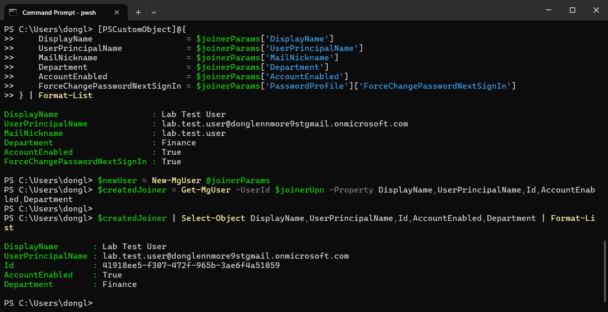
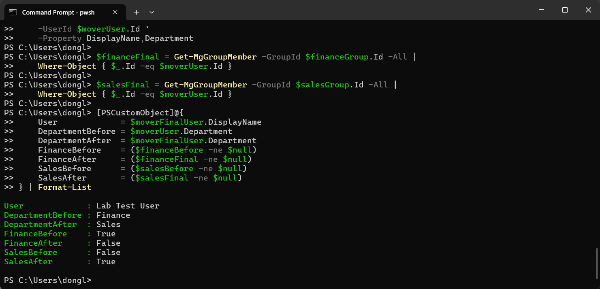
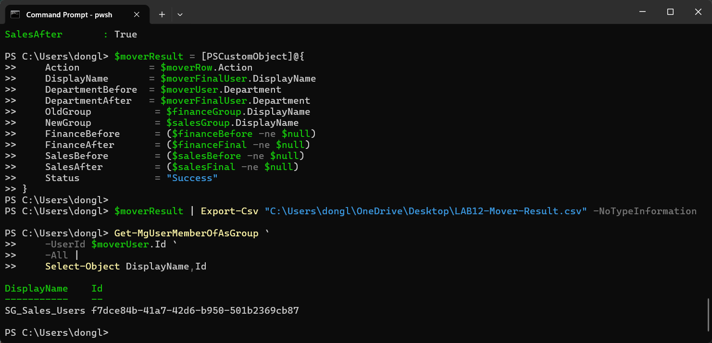
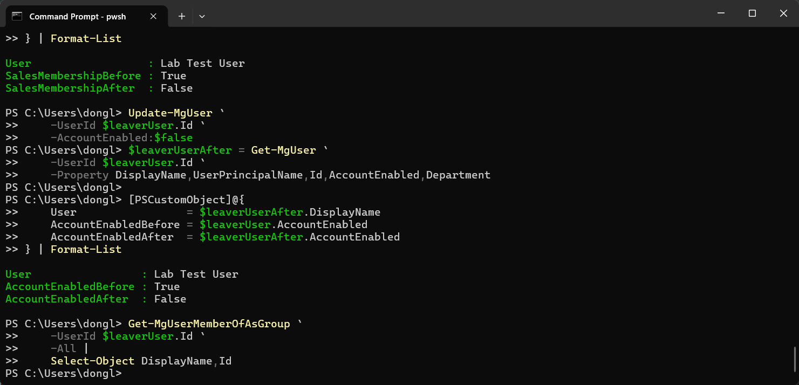
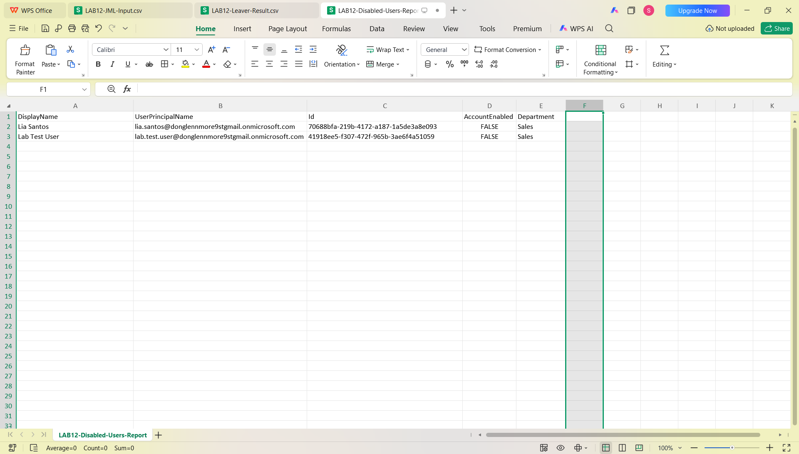
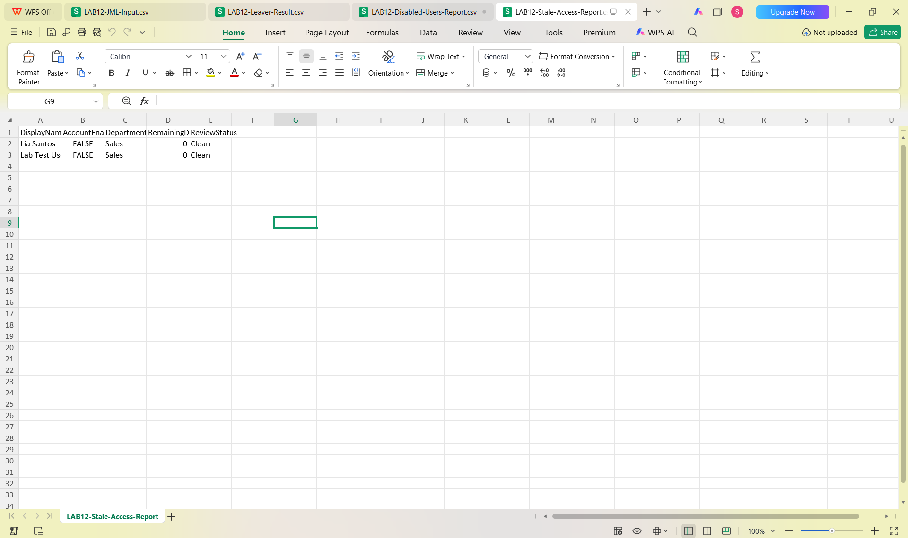
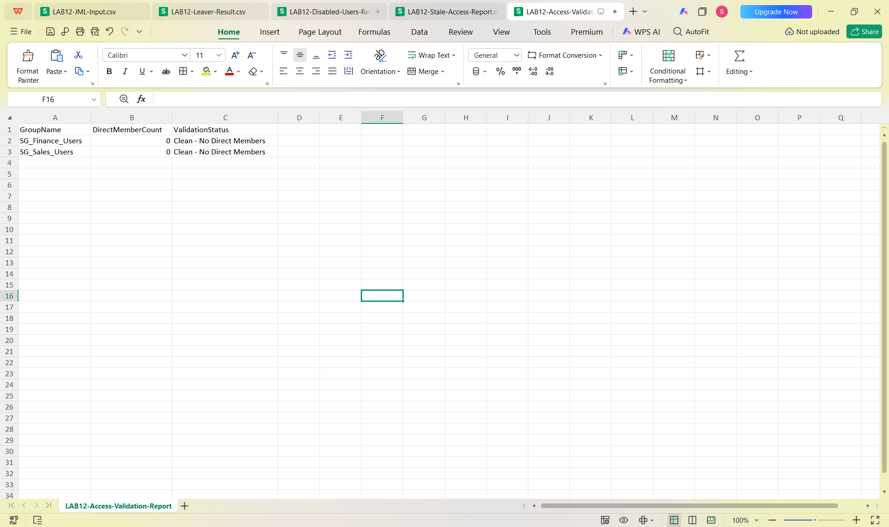
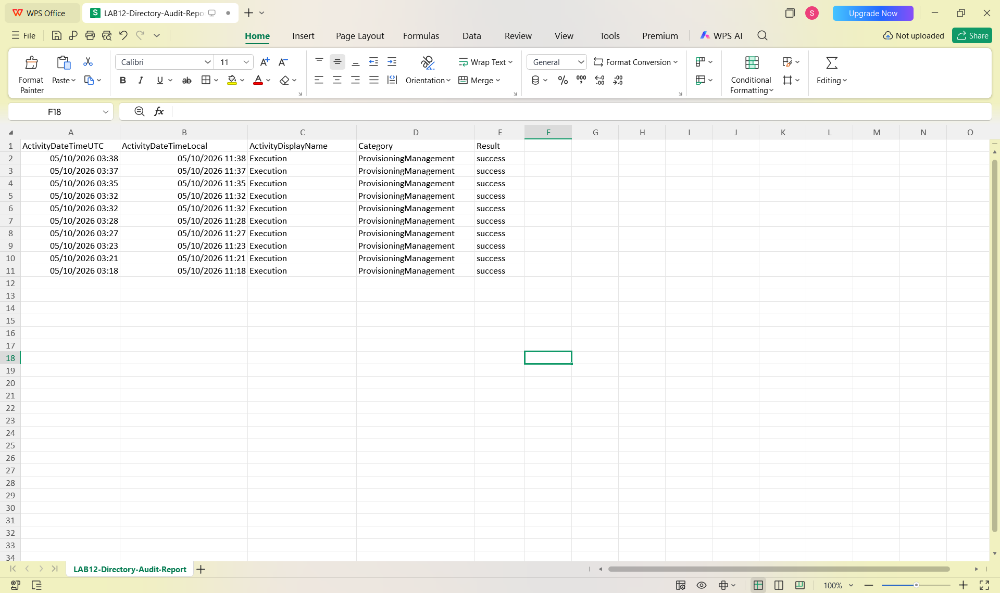
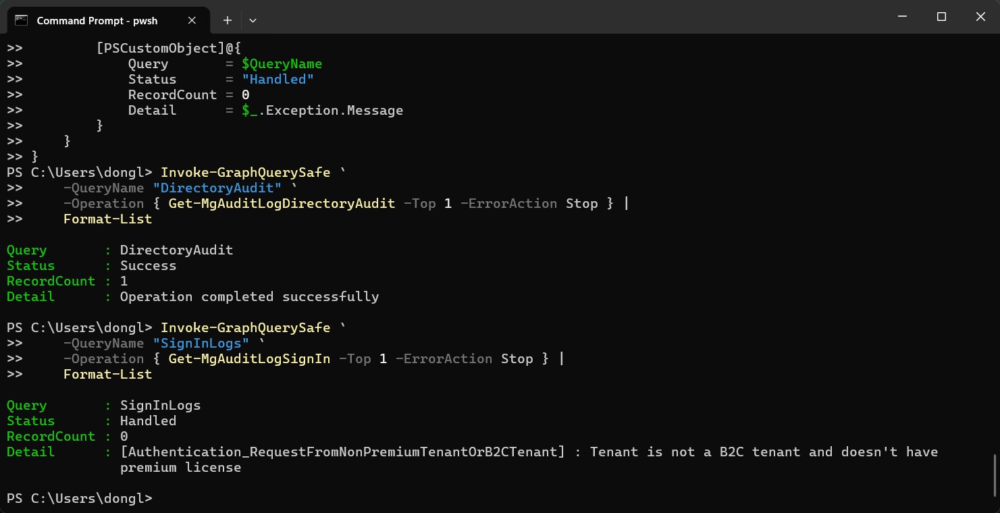

# Microsoft Graph PowerShell IAM Automation Lab

Hands-on IAM automation project using Microsoft Graph PowerShell to simulate enterprise identity lifecycle operations, access management, validation, reporting, and error handling.

## 🎯 Project Objective

The goal of this lab was to automate common Identity and Access Management (IAM) tasks while following secure operational practices:

- Joiner, Mover, and Leaver lifecycle workflows
- User and group management
- Access validation
- Stale-access review
- Disabled-user reporting
- Microsoft Entra audit-log retrieval
- CSV-based input and reporting
- Certificate-based Microsoft Graph authentication
- Reusable PowerShell error handling

## 🛠️ Technologies Used

- Microsoft Entra ID
- Microsoft Graph
- Microsoft Graph PowerShell SDK
- PowerShell 7
- App Registration
- Certificate-based authentication
- CSV input/output

## 🔐 Authentication

Configured application-only Microsoft Graph authentication using an Entra App Registration and certificate.

The workflow validated:

1. Certificate availability
2. App registration configuration
3. Microsoft Graph application permissions
4. Admin consent
5. Certificate-based Graph connection

## 👤 Joiner Workflow

Automated and validated creation of a new identity using CSV-based input.

Workflow:

`CSV Input → Validate Request → Create User → Assign Group → Verify Result`

Evidence:

## 🔄 Mover Workflow

Simulated an employee moving from Finance to Sales.

The workflow included:

- Identify the Mover record
- Validate required attributes
- Verify the current user
- Resolve source and target groups
- Update the department
- Remove old Finance access
- Add Sales access
- Verify the final state

Evidence:

## 🚪 Leaver Workflow

Performed controlled offboarding by disabling the identity and validating that no direct group memberships remained.

Evidence:

## 🔎 Access Review and Reporting

Created PowerShell-based reports for:

- Disabled users
- Remaining group access
- Stale access
- Access validation
- Directory audit events

Evidence:

## 🛡️ Robust Error Handling

Built a reusable PowerShell wrapper using `try` / `catch` logic to handle Microsoft Graph query success and failure consistently.

The wrapper records:

- Query name
- Success or handled failure
- Record count
- Error or completion details

Evidence:

## 🔐 Security Principles Applied

- Least Privilege
- Identity lifecycle management
- Access validation
- Stale-access remediation
- Authentication and authorization
- Auditability
- Verification before change
- Error handling
- Separation of identity attributes and access permissions

## 🧠 Key Learning

This project reinforced an important IAM workflow:

`Validate → Identify → Baseline → Change → Verify → Audit → Document`

A successful command alone is not enough. IAM changes should be verified through the resulting identity state, access membership, and available audit evidence.

## 📌 Project Scope

This repository represents a structured hands-on lab and production-style IAM simulation. It does not represent management of a live enterprise production environment.
